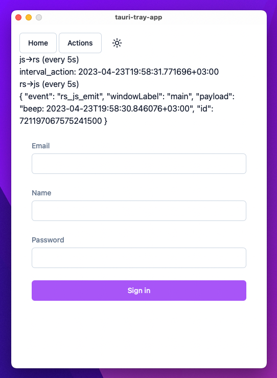
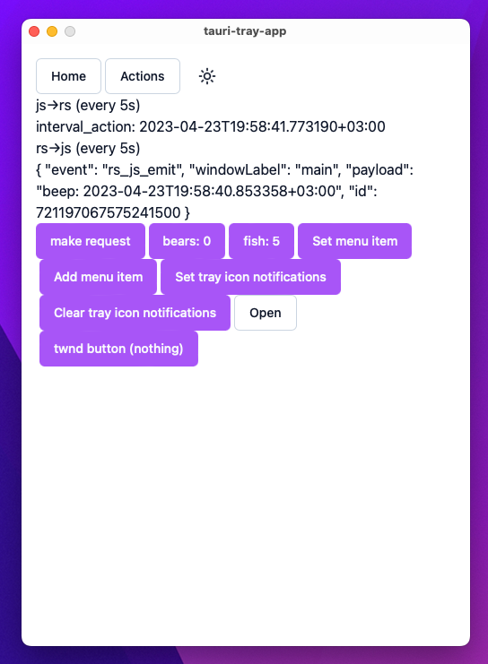
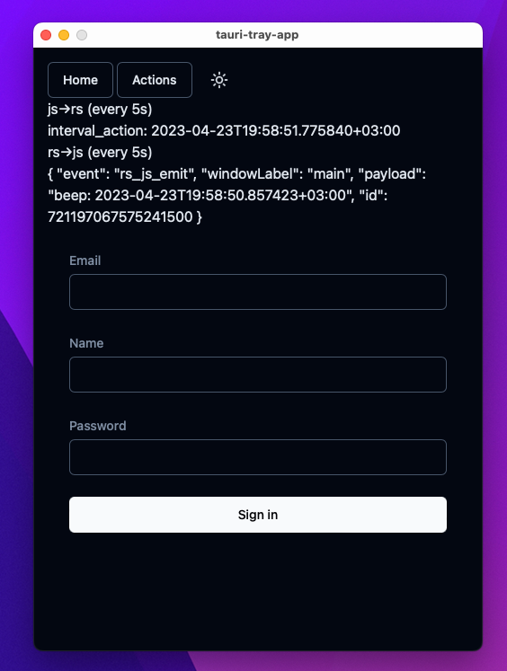
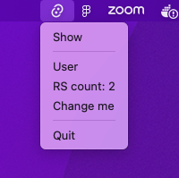

# Tauri Tray App

This template should help get you started developing a Tauri tray app with an app window and full communication between the Javascript and Rust side.

**Components**:

* **Rust**: tauri, chrono, reqwest, anyhow
* **Javascript**: typescript, eslint, Vite, React, storybook, Zustand fully configured.
* **Styles**: tailwind, tw-classed and [shadcn/ui](https://ui.shadcn.com)





## Quick start

Use [makeme](https://github.com/jondot/makeme) for easy task management and then:

```bash
$ mm i
$ mm s
```

To start storybook:

```bash
$ mm sb
```


## Overview

* [src/demo](src/demo/) showcases on multiple use cases:
  * Actions [demo/actions.tsx](src/demo/actions.tsx):
    1. IPC Rust <> JS, both directions with actions
    2. IPC Rust <> JS, passively triggered with timers from both sides (to show that an app can be always-on and background processes still run)
    3. Trigger state change in native tray-icon and native tray-menu
  * Signup form [demo/signup.tsx](src/demo/form.tsx)
    1. A way to submit form data to Rust and get back a response, like working with a server


* UI: 
  * `components/ui` -  components mirror from [ui.shadcn.com](https://ui.shadcn.com)
  * `components/xui` - extended UI components building on top of `shadcn/ui`, with tooling to ease some verbosity and make it closer to classic js styling libs (`tw-classed`), see [Button](src/components/xui/button/index.tsx)


## Additional components

* State management: `zustand` [src/zstore/](src/zstore)
* Routing: `react-router-dom` [src/main.tsx](src/main.tsx)
* Storybook: [src/stories/](src/stories/) (task: `mm sb`)
* Styling: `tailwind` [tailwind.config.ts](tailwind.config.js) + `index.css` [src/index.css](src/index.css)
* Components: `components/ui` [components/ui](src/components/ui) (and `components/xui`), use [shadcn/ui](https://ui.shadcn.com/) for inspiration reviewing components use
* Lints: `eslint` + `stylomatic` [.eslintrc.js](.eslintrc.js)

# License

Copyright (c) 2023 [@jondot](http://twitter.com/jondot). See [LICENSE](LICENSE.txt) for further details.
